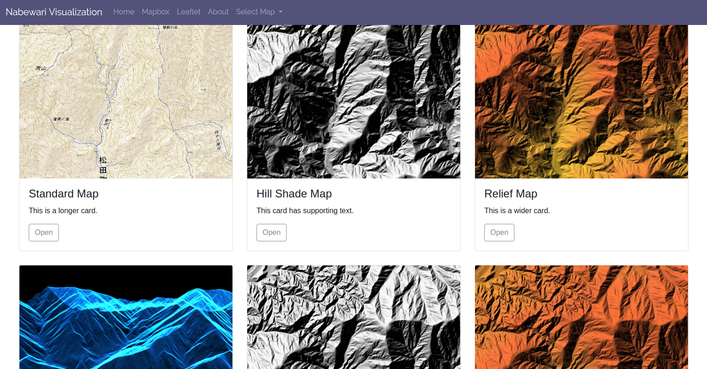

# nabewari_visualization
Flaskを使って可視化



# Setup
- virtualenv
```
virtualenv venv
. venv/bin/activate
```

- install Flask
```
pip install Flask
```

- run
```
export FLASK_APP=nabewari_visualization.py
flask run
```
